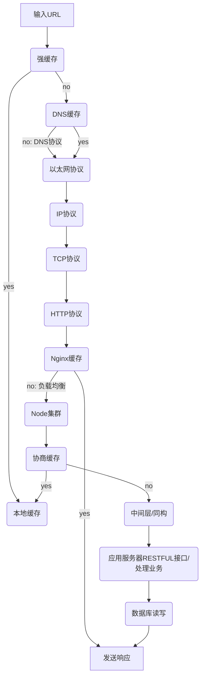
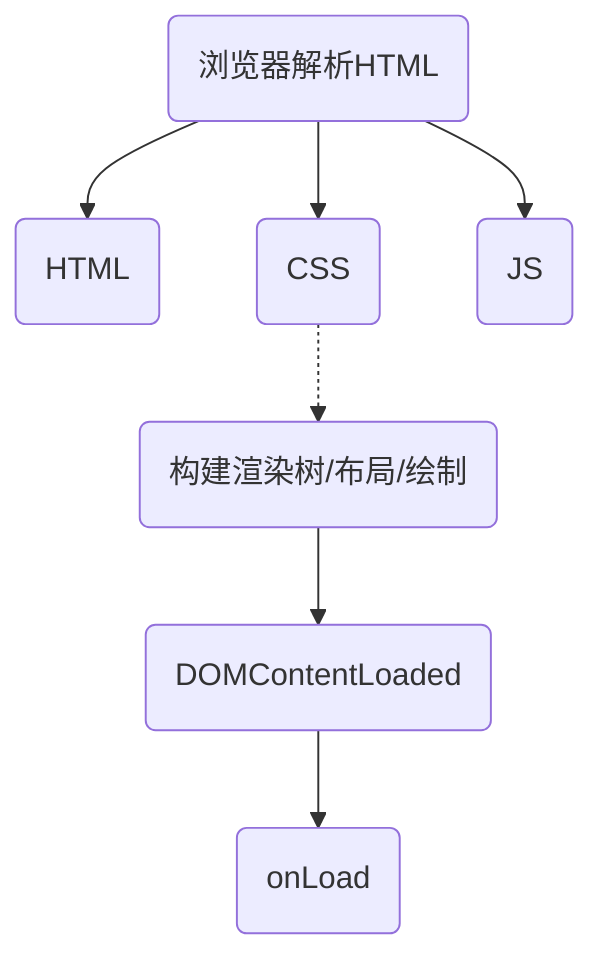

[TOC]

### 浏览器加载过程
#### 网络请求

#### 浏览器渲染

***
### 网络优化
#### 离线缓存
##### Application Cache（Manifest）
HTML5缓存技术。html标签中添加manifest属性，属性值为manifest文件的路径。manifest文件是文本文件，它会告知浏览器需要缓存的内容以及不需要缓存的内容。

##### Service workers
是 Web Worker 的一种，相当于代理服务器，可以拦截请求，意味着可以在离线环境下响应请求。
* 基于 Https；
* 每个 Service Workers 只会处理自己作用域下的请求；
* 它不能直接操作 DOM，通过 postMessage 与主窗口通信。

#### 强缓存
* **Expires** 是HTTP/1.0提出的表示资源过期时间的响应头，它描述的是一个绝对时间，由服务器返回。Expires 受限于本地时间，如果修改了本地时间，可能会造成缓存失效。如 Expires: Wed, 11 May 2018 07:20:00 GMT。
* **Cache-Control** 出现于HTTP/1.1，表示的是相对时间，优先级高于 Expires。如 Cache-Control: max-age=315360000。

#### 协商缓存
* **Last-Modified**（响应头）与 **If-Modified-Since**（请求头）表示本地文件最后修改日期。
* **ETag**（响应头）与 **If-None-Match**（请求头）表示资源的唯一标识。

#### DNS缓存
减少DNS查询和解析域名，尽量使用同域名。

#### HTTP协议
HTTPS：
* 二进制协议解析
* 多请求、响应
* 可以控制数据流优先级，标记、取消数据流
* 头信息压缩、重用
* 服务器推送

#### 同构
**SPA**：单页面应用，前端渲染和交互。
**直出**：服务端渲染，纯后端渲染。
**同构**：后端渲染，前端交互。服务端直出和客户端渲染组合，结合两者的优势并避免两者的不足。代码部署在后端，代码同时运行在服务端和客户端。与SPA相比，SSR返回的数据多了个静态页面（字符串形式）。

**同构的好处**：
* SEO
* Node直出，[首屏渲染](https://app.yinxiang.com/shard/s49/nl/11185452/2da63bac-8bb8-4b28-ab98-80ed0e98ea98/)速度快
* 前后端共享某些代码

#### 其他
* 减少http请求
* 避免重定向
* 减小资源大小：如Webpack压缩合并、打包、缓存、懒加载、去重等
* 使用CDN
* Ajax缓存

***
### 浏览器渲染优化
1. 浏览器解析HTML/XHTML/SVG生成**DOM树**（DOM Tree）
2. 浏览器解析CSS生成**CSS规则树**（CSS Rule Tree / CSSOM）
3. 在生成DOM树过程中，如果遇到JavaScript，浏览器暂停构建DOM，先下载和构建CSSOM（因为JS可以修改CSSOM），然后再执行JS，最后继续构建DOM。*JS通过DOM API和CSSOM API来操作DOM Tree和CSS Rule Tree*
4. 浏览器引擎通过**DOM树**和**CSS规则树**来构造**渲染树**（Rendering Tree）。*像  <header> 或 display: none; 不会出现在渲染树中*
5. 浏览器根据渲染树**布局/回流/重排**（Flow），布局完成后**绘制/重绘**（Paint）。*_**回流**会引发**重绘**，**重绘**不一定引发**回流**_*

#### HTML
* 优化加载顺序
* 异步加载css、js（如：使用async、defer）
* 外链css、js，利用浏览器的缓存机制
* 避免嵌套
* 避免空标签、空格、注释，避免空的src、href属性，删除默认属性
* 语义化：有利爬虫、开发可读、屏读

#### CSS
* 避免嵌套
* 选择器
* 属性：重排（如：改变外边距）、重绘（如：页面滚动时禁用hover事件）、盒模型顺序
* 启用GPU硬件加速

#### JS
##### API Time complexity
indexOf() O(n)
hasOwnProperty() O(1)
(new Set()).has() O(1)

##### 垃圾回收
内存泄漏：不再用到的内存，没有及时释放：
* 作用域未释放
* 较长生命周期的键值对象缓存、多余的全局变量
* 无效的DOM引用
* 事件监听未清除
* 定时器未清除

内存泄漏优化：
* 避免并解除闭包
* 避免使用较长生命周期的键值对象缓存而是拆分成多个、清空变量
* 解除引用
* 清除监听器
* 清除定时器
* WeakSet 和 WeakMap 对于值的引用都不计入垃圾回收机制
* Node 中使用 stream 或 buffer 来操作大文件，不会受 Node 内存限制
* 使用 redis 等外部工具缓存数据

##### 防抖节流
* 防抖：事件被触发后延时执行函数，如果在延时时间内又被触发，则重新计时
* 节流：单位时间内只能触发一次，触发多次只有第一次生效

##### 框架
**React**：
1. 不要进行DOM节点跨层级的操作，可以通过CSS隐藏显示节点
2. 组件保持同类型并结合 shouldComponentUpdate()
3. 唯一key
4. 拆分组件
5. bind在constructor中绑定，不要在使用时绑定
6. 组件中箭头函数对于组件来说每次绑定的都是新的函数，从而引发重新渲染
6. 默认属性的值要放在变量中缓存
6. 无状态组件
7. 继承 `React.PureComponent`生成组件，render前进行浅比较，从而决定是否更新组件
8. 官方或第三方库

**Redux**：
1. store扁平化，避免嵌套
2. store范式化，尽可能少的数据
3. 将和redux有连接的多个组件拆分成多个 connect 的单个组件
4. `mapStateToProps`会将组件的props作为第二个参数，在此做比较使传入组件的props为boolean

###### 其他
* localStorage，sessionStorage
* 尾调用，尾递归

#### 首屏渲染
###### 白屏时间 首屏时间
* 白屏时间是指浏览器从响应用户输入网址地址，到浏览器开始出现第一个元素的时间，影响因素是网络、服务端性能、前端页面结构设计。new Date() - performance.timing.navigationStart
* 首屏时间是指浏览器从响应用户输入网络地址，到首屏内容渲染完成的时间，影响因素是白屏时间、资源下载执行时间。new Date() - window.onload => performance.timing.navigationStart
